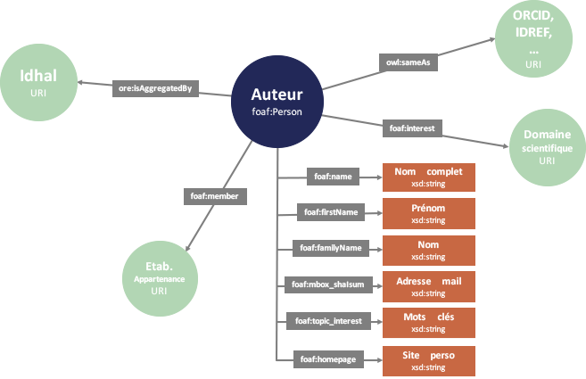
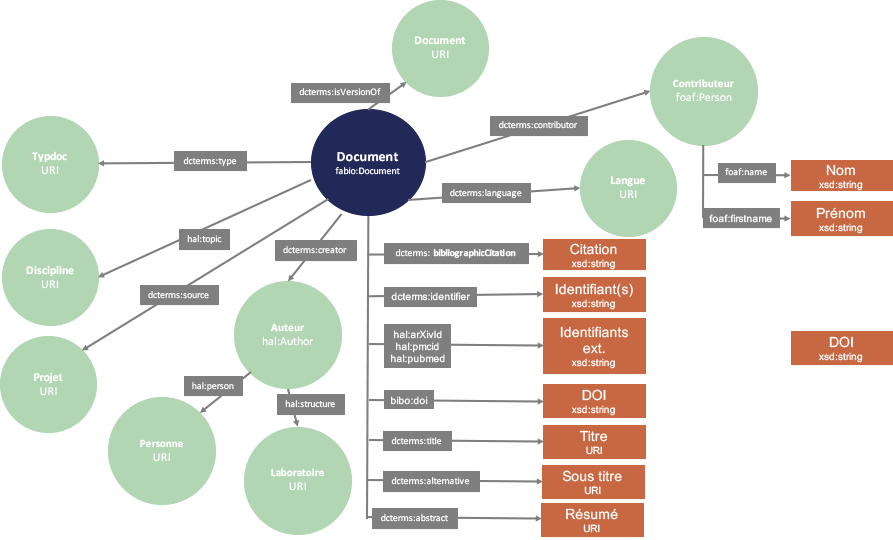

```{r setup, include=FALSE}
knitr::opts_chunk$set(echo = TRUE)
```

This article deals with queries on the [HAL](https://hal.science/) triplestore, [dataHAL](https://data.hal.science/). **HAL** is the **bibliograpic open archive** chosen by French research institutions, universities, and grandes écoles. Hence, we suppose this article will only be useful to French-speaking R users and will provide it **in French** from now on...

Les données contenues dans le triplestore HAL sont a priori utilisables pour générer des **rapports bibliographiques** pour une **personne**, une **organisation** (UMR par exemple), en triant par exemple par **année** ou par **période**.

On peut ainsi imaginer utiliser ces données pour **générer automatiquement et de manière reproductible** un certain nombre de **tables ou graphiques** en lien avec les **évaluations** du personnel publiant des établissements de recherche.

Dans la suite de cet article je montrerai comment explorer et exploiter ces données à l'aide de R, et (notamment) du package glitter.

```{r libs}
library(glitter)
library(tidyverse)
```


# Entrée par auteur

HAL fournit divers schémas représentant leur modèle de données. Voici celui correspondant à une entrée **par auteur**: 



Essayons par exemple d'examiner s'il existe dans la base quelqu'un qui s'appelle (tout à fait au hasard) "Lise Vaudor":

```{r}
test_LV=spq_init() %>% 
  spq_add("?personne foaf:name 'Lise Vaudor'")  %>%  # récupère les personnes appelées "Lise Vaudor"
  spq_perform("hal")
DT::datatable(test_LV)
```
Il existe bien une personne ayant ce nom dans la base de données, qui fait l'objet d'une fiche consultable [ici](`r test_LV$personne[1]`).

La consultation de cette page montre que deux propriétés sont souvent renseignées: **foaf:interest** et **foaf:topic_interest**. Cette dernière propriété semble regrouper des mots-clés issus de l'ensemble des publications de l'auteur alors que foaf:interest correspond à des centres d'intérêt déclarés (probablement lors de la création du profil HAL: à vrai dire je ne m'en souviens plus!).

Quoi qu'il en soit, l'information relative aux centres d'intérêt est accessible comme suit:

```{r}
interet_LV=spq_init() %>%
  spq_add("?personne foaf:name 'Lise Vaudor'")  %>%
  spq_add("?personne foaf:interest ?interet") %>%        # récupère les centres d'intérêt
  spq_add("?interet skos:prefLabel ?interet_label") %>%  # étiquette les centres d'intérêt
  spq_filter(lang(interet_label) == 'fr') %>%               # garde seulement les étiquettes en français
  spq_perform("hal")
DT::datatable(interet_LV)
```

# Documents d'un auteur

Voici le modèle de données fourni par HAL pour une entrée par document:



Une des petites subtilités du modèle de données HAL consiste à considérer que **un document a un créateur -ou auteur- et un créateur correspond à une personne**.

## Affiliations

Par exemple, l'article "How sampling influences the statistical power to detect changes in abundance: an application to river restoration" a pour créatrice (entre autres personnes) "Lise Vaudor à l'époque du Cemagref", qui correspond à la personne "Lise Vaudor" qui elle est intemporelle ;-). Ainsi, c'est en considérant les créateurs de documents que l'on va récupérer les affiliations: **l'affiliation est une information qui se récupère en adoptant une entrée par document plutôt que par auteur**.


```{r}
orga_LV=spq_init() %>%
  spq_add("?doc dcterms:creator ?createur") %>%        # documents crées par créateur
  spq_add("?createur hal:structure ?affil") %>%        # créateur correspond à une affiliation
  spq_add("?createur hal:person ?personne") %>%        # créateur correspond à une personne
  spq_add("?personne foaf:name 'Lise Vaudor'") %>%     
  spq_add("?affil skos:prefLabel ?affiliation") %>%    # étiquette affiliation
  spq_group_by(affiliation) %>%                        # groupe par affiliation
  spq_summarise(n=n()) %>%                             # renvoie le nombre d'enregistrements
  spq_perform("hal") %>% 
  arrange(desc(n))

DT::datatable(orga_LV) 
```

## Documents 

Si l'on ne s'intéresse pas aux affiliations mais aux **documents** eux-mêmes:

```{r}
docs_LV=spq_init() %>%
  spq_add("?doc dcterms:creator ?createur") %>%        
  spq_add("?createur hal:structure ?affil") %>%        
  spq_add("?createur hal:person ?personne") %>%        
  spq_add("?personne foaf:name 'Lise Vaudor'") %>%
  spq_add("?affil skos:prefLabel ?affiliation") %>%    
  spq_add("?doc dcterms:type ?type") %>%            # récupère le type de document
  spq_add("?type skos:prefLabel ?type_label") %>%   # étiquette le type de document      
  spq_filter(lang(type_label) == 'fr') %>%          # ... en français
  spq_add("?doc dcterms:bibliographicCitation ?citation") %>% # récupère la citation
  spq_add("?doc dcterms:issued ?date") %>%                    # et la date de publication
  spq_perform("hal") %>% 
  mutate(date=stringr::str_sub(date,1,4)) %>%       # simplifie la date pour ne garder que l'année
  group_by(citation,type_label,date) %>%            # pour une citation, un type, une date
  summarise(affiliation=paste(affiliation, collapse=", ")) # simplifie l'affiliation

dim(docs_LV)  
DT::datatable(docs_LV %>% arrange(desc(date)) %>% head(20)) # Montre les 20 documents les plus récents
```


# Entrée par laboratoire


## Identification du laboratoire

Intéressons-nous maintenant aux publications issues d'un laboratoire. Ici, nous avons choisi le laboratoire "Environnement Ville Société", alias "EVS" ou encore "UMR 5600".

Essayons de le retrouver dans la base de données:

```{r}
labo_EVS=spq_init() %>%      
    spq_add("?labo skos:prefLabel ?labo_label") %>%
    spq_add("?labo dcterms:identifier ?labo_id", .required=FALSE) %>% 
    spq_filter(str_detect(labo_label,"EVS|(UMR 5600)|(Environnement Ville Soc)")) %>%
    spq_perform("hal")
labo_EVS
```

Bon! Eh bien, étant donné la diversité des formats dans la dénomination d'EVS, un petit tri manuel s'impose.

```{r}
labo_EVS= labo_EVS %>% 
  unique() %>% 
  mutate(num=1:n()) %>% 
  filter(!(num %in% c(1,2,3,18))) %>%  # ici je retire les labos qui ne correspondent pas à UMR 5600 / EVS
  select(-num)
DT::datatable(labo_EVS)
```
Créons maintenant une fonction qui permet de récupérer l'ensemble des documents pour chacune de ces dénominations de laboratoire.

```{r}
get_docs_lab=function(lab){
  lab=paste0("<",lab,">")
  result=spq_init() %>%      
  spq_add(glue::glue("?createur hal:structure {lab}")) %>% 
  spq_add("?createur hal:person ?personne") %>%
  spq_add("?personne foaf:name ?auteur") %>%
  spq_add("?doc dcterms:creator ?createur") %>% 
  spq_select(-createur) %>%
  spq_add("?doc dcterms:type ?type") %>%            # récupère le type de document
  spq_add("?type skos:prefLabel ?type_label") %>%   # étiquette le type de document
  spq_filter(lang(type_label) == 'fr') %>%          # ... en français
  spq_add("?doc dcterms:bibliographicCitation ?citation") %>% # récupère la citation
  spq_add("?doc dcterms:issued ?date") %>%
  spq_perform("hal") %>%
  mutate(date=stringr::str_sub(date,1,4))  %>% 
  select(auteur, type=type_label, date, citation)
  return(result)
}

if(!file.exists("docs_EVS.RDS")){
  docs_EVS=labo_EVS %>% 
    group_by(labo,labo_label) %>%
    tidyr::nest() %>% 
    mutate(data=purrr::map(labo,get_docs_lab)) %>% 
    tidyr::unnest(cols="data") 
  saveRDS(docs_EVS,"docs_EVS.RDS")
}
docs_EVS=readRDS("docs_EVS.RDS")
dim(docs_EVS)
```

```{r}
docs_EVS_show=docs_EVS %>% 
  select(-labo) %>%
  filter(date>=2020) %>% 
  unique() %>% 
  ungroup()
  
dim(docs_EVS_show)  
DT::datatable(docs_EVS_show) 
```

```{r}
docs_datecitation=docs_EVS %>%
  group_by(type) %>% 
  mutate(ntype=n()) %>% 
  ungroup() %>% 
  mutate(ntot=n()) %>%
  mutate(proptype=ntype/ntot) %>% 
  filter(proptype>0.05) %>% 
  group_by(date,citation,type) %>%
  summarise(n=n()) %>% 
  filter(date>2015)

ggplot(docs_datecitation, aes(x=date,y=n, fill=type)) +
  geom_bar(stat="identity")+
  facet_grid(rows=vars(type))
```

